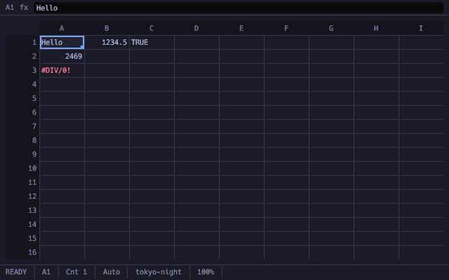
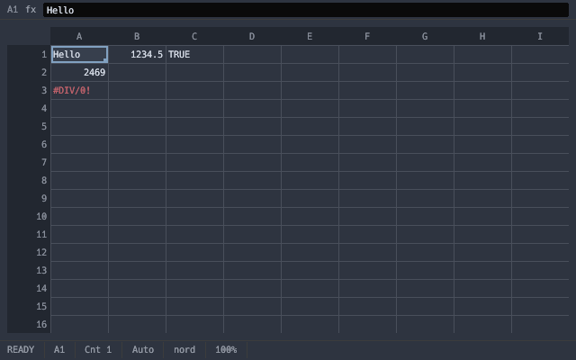
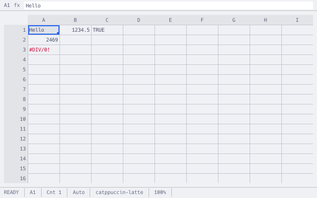

# Omacell

**A spreadsheet for [Omarchy](https://omarchy.org/).**

Excel's meaning. Omarchy's manners.

<p align="center">
  
</p>

The grid, the A1 language, recalculation, number formats, the error model, and `.xlsx` as the file you actually email. No ribbon. No account. No theme of its own. The desktop you already tuned is the chrome.

One engine. Three clients. The same workbook, the same answers.

```text
omacell book.xlsx            # Wayland GUI
omacell --tui book.xlsx      # terminal, SSH, tmux
omacell query book.xlsx 'Summary!A1:D20' --json
```

## Why another spreadsheet?

Omarchy already ships LibreOffice Calc. Omacell is not trying to out-feature it. It is trying to **out-fit** it.

| You want | Calc / Excel / the cloud | Omacell |
|---|---|---|
| Open the `.xlsx` a colleague sent | Often a conversion, a wizard, or a browser | Live workbook. Formulas, styles, pivots, charts. Save it back. |
| The theme you picked this morning | Someone else's gray | The active Omarchy theme. Switch it; the grid follows. |
| Keyboard as the real UI | Mouse with shortcuts | Excel-classic *and* Vim-modal maps, both remappable TOML |
| Drive it from a shell or an agent | Macros, COM, hope | One command bus: CLI, Lua, IPC, MCP, models |
| Privacy | Telemetry, accounts, “helpful” uploads | Off the network until you say otherwise. AI is off until you turn it on. |

Type, see the result, fill down. Errors are values (`#DIV/0!`, `#REF!`, `#SPILL!`) that propagate instead of crashing the sheet. Dates are numbers with a format. `0.25` displayed as `25%` is still `0.25`. That is Excel, distilled — and it is non-negotiable.

What we discarded is the ceremony: floating dialogs, an in-app theme editor, a settings maze, anything that phones home.

## Three faces, one engine

<p align="center">
  
  
  
</p>

<p align="center"><sub>Same grid. Tokyo Night, Nord, Catppuccin Latte — whatever Omarchy is wearing.</sub></p>

**GUI.** A Wayland window that tiles under Hyprland, follows the system monospace font and text size, and keeps dialogs as in-window panels so they do not steal focus from the compositor.

**TUI.** A first-class client, not a demo. Work a model over SSH or inside a tmux pane.

```text
A1  fx Hello
    │   A    │   B    │   C    │   D
   1│Hello   │  1234.5│TRUE    │
   2│    2469│        │        │
   3│#DIV/0! │        │        │
READY  A1  Auto  tokyo-night  100%  AI: off
```

**CLI / IPC.** The same commands the UI runs, with `--json` everywhere — the same shape as `omarchy` itself, so a script or an agent can open, query, edit, recalc, and export without a screen.

```bash
omacell convert export.csv model.xlsx
omacell set model.xlsx Inputs!B3 0.07
omacell recalc model.xlsx --write
omacell query model.xlsx 'Summary!A1:D20' --json
omacell eval model.xlsx '=XIRR(Cash!B2:B40,Cash!A2:A40)'
omacell run monthly.lua model.xlsx
omacell audit model.xlsx --json
```

## Built for the work you actually do

- **Be a real spreadsheet.** `LET` / `LAMBDA`, dynamic arrays, tables and structured refs, sort / filter / validation / conditional format, pivots, Goal Seek, charts and sparklines, print to PDF.
- **Round-trip `.xlsx`.** Open, edit, save, send back. Unknown parts stay byte-for-byte. Native `.xls` read (no LibreOffice required); write `.xlsx`, `.ods`, CSV, `.omc`, JSON, HTML, Markdown. Parquet/Arrow read.
- **Feel native to Omarchy.** `~/.config/omacell/` is yours and survives updates. `omacell setup omarchy` installs the theme hook. `omacell config reset` is the counterpart of `omarchy reinstall configs`.
- **Stay local.** No telemetry, no accounts, no network on file open. Embedded Lua is sandboxed until you trust the file hash. AI payloads go through one privacy choke point, and only after you configure a provider.
- **Scriptable by people and agents.** Lua 5.4 in-process (the Hyprland / Neovim dialect). An MCP server and a shipped skill so `omarchy agent prompt "reconcile these two sheets"` has somewhere to land. Every AI or agent mutation is a reviewable, undoable changeset — never a silent edit.

Two keymaps ship. Classic is Excel's dialect (`F2`, `Ctrl+D`, `Ctrl+Shift+L`, `F4` to cycle `$`). Modal is sc-im / Vim (`hjkl`, counts, operators). Bindings live in TOML. Super stays the compositor's.

## For agents

Models are operators of the grid, not a sidebar chatbot glued on later. They do not pick themselves: local models are the default path, no vendor is bundled, and nothing runs until `omacell ai setup`.

```bash
omacell mcp --book model.xlsx          # MCP over stdio
omacell commands --json                # the whole command catalog
omacell changeset list                 # review before apply
omacell agent "flag totals over 10k"   # hand off to your Omarchy default agent
```

External tools propose. You apply. Undo is one unit.

## Status

Pre-alpha, built in the open. The engine, GUI, TUI, CLI, I/O, Lua, MCP, AI,
Arch packaging, and release automation are in-tree and tested. Privileged
Omarchy-channel, fixed-hardware, accessibility, and public-name gates still
stand between the current tree and a public 1.0 tag. Dogfood it, break it, file
the corpus row.

See [`docs/spec/omacell-design-spec.md`](docs/spec/omacell-design-spec.md) for the product, [`docs/build/PLAN.md`](docs/build/PLAN.md) for the build, and [`reports/`](reports/) for what each package actually shipped.

## Build

Rust 1.98 (`rust-toolchain.toml`) and [just](https://github.com/casey/just).

```bash
just check                       # fmt, clippy, tests, docs
cargo run -p omacell-cli -- --version
cargo run -p omacell-cli -- book.xlsx
cargo run -p omacell-cli -- --tui book.xlsx
```

Packages that touch a §12.1 budget record Criterion output with `just
perf-baseline`; `just perf-check` validates the complete committed budget
table. The scheduled fixed-host workflow performs the actual 17 product
measurements, creates a commit/run-attributed `perf-results.json`, and rejects
missing, duplicated, stale, or over-budget results. Its live AI rows require
the configured local/cloud endpoint and model variables plus the cloud token
secret; credentials remain environment-only.

On Omarchy, Wayland is already there. The TUI needs a real TTY. AI stays quiet until you configure a provider.

## Layout

```
crates/     core fn io lua ai conf bus ui tui gui cli
default/    shipped config, keymaps, theme template, agent skill
docs/spec   design specification
docs/build  work packages and the agent build plan
docs/adr    architecture decision records
reports/    per-package reports
packaging/  PKGBUILD, desktop entry, mime, icons
tests/      corpora and fixtures
```

[`AGENTS.md`](AGENTS.md) is binding for anyone (human or model) landing code.

## License

[MIT](LICENSE).
