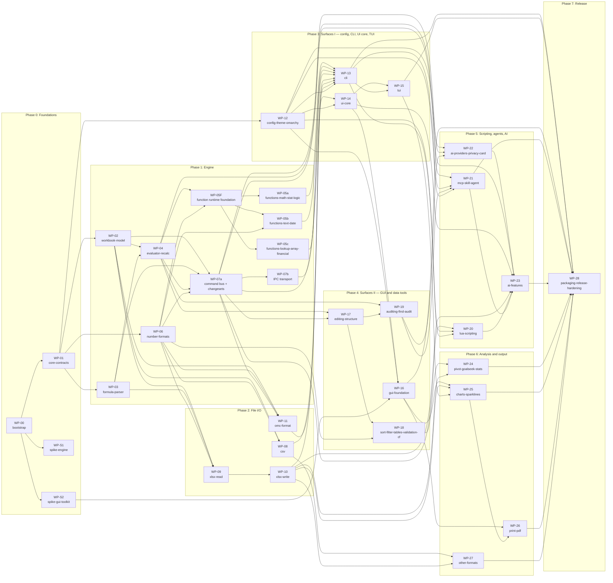

# Omacell — Build Plan for AI-Agent Execution

Companion to `spec/omacell-design-spec.md` (v0.3). The spec says *what*; this plan says *in what order*, *by whom*, and *how we know it is done*. Every unit of work is a **work package (WP)**: one markdown file under `wp/`, written so an agent can execute it with only `AGENTS.md`, the WP file, and the listed spec sections in context.

## 1. How to use this bundle

1. Create the repository and copy this bundle to `docs/build/` and the spec to `docs/spec/`. Put `AGENTS.md` at the repo root (WP-00 does this).
2. Run WP-00 first, alone. Then WP-S1, WP-S2, and WP-01 (they may run concurrently).
3. From Gate G0 onward, run up to one agent per lane (§5) concurrently. Never run two agents in the same crate on overlapping modules.
4. Kick off each package with `templates/agent-kickoff-prompt.md`. The agent writes a plan into `reports/<WP>.md` first, tests second, code third, and opens a PR. A human merges.
5. Hold the gate reviews in §4 before starting the next phase's packages.

## 2. Decisions this plan assumes (override before starting, not during)

The spec left several choices as ADRs. Agents need fixed contracts, so this plan picks defaults. Change them here, once, before WP-00.

| # | Decision | Default | Why | Revisit if |
|---|---|---|---|---|
| D1 | Language and build | Rust, stable toolchain, edition 2024, single Cargo workspace | One toolchain, memory safety on untrusted files, best agent ergonomics | Never (foundational) |
| D2 | Engine (ADR-002) | **Build** `omacell-core` per spec §11.3 | Full control over dynamic arrays, async AI nodes, storage budgets | WP-S1 shows IronCalc covers L1/L2 and the graph performance with a compatible license |
| D3 | GUI toolkit (ADR-001) | **eframe/egui on wgpu**, custom grid painter | Pure Rust; agents ship it fastest; AccessKit and winit IME exist; front-end is isolated behind the command bus so a later swap is contained | WP-S2 fails IME or accessibility; then plan a Qt Quick front-end as a separate lane |
| D4 | TUI | ratatui + crossterm | Standard, testable with `TestBackend` | — |
| D5 | Scripting | Lua 5.4 via `mlua` (vendored) | Spec ADR-004 | — |
| D6 | MCP | `rmcp` (official Rust SDK) over stdio and socket | Spec §8.5 | — |
| D7 | `.xlsx` | Own OOXML layer over `zip` + `quick-xml`; `calamine` only as a test oracle | Round-trip and L3 preservation need part-level control | — |
| D8 | AI providers (ADR-005) | Two wire protocols (OpenAI-compatible, Anthropic Messages); no vendor SDKs; async confined to `ai`/MCP via `tokio` | Spec §8.1 | — |
| D9 | Skill format (ADR-006) | `SKILL.md` directories, same layout as Omarchy's | Spec §8.8 | — |
| D10 | License | MIT placeholder | Matches Omarchy; human confirms before first public tag | Human decision |
| D11 | Name | `omacell` (chosen 27 Aug 2026; previously `omacalc`), held in one constant and one packaging variable | Rename is a script (WP-28) | Omarchy-project clearance or trademark search says no |
| D12 | Test policy | Corpora first; no network in CI; LibreOffice/openpyxl cross-checks skip when absent; performance gates with committed baselines | Spec §14 | — |

## 3. Phases

| Phase | Name | Packages | Gate |
|---|---|---|---|
| 0 | Foundations | WP-00, WP-01, WP-S1, WP-S2 | G0 |
| 1 | Engine | WP-02, WP-03, WP-06, WP-04, WP-05F, WP-05a, WP-05b, WP-05c, WP-07a, WP-07b | G1 |
| 2 | File I/O | WP-08, WP-09, WP-10, WP-11 | G2 |
| 3 | Surfaces I — config, CLI, UI core, TUI | WP-12, WP-13, WP-14, WP-15 | G3 |
| 4 | Surfaces II — GUI and data tools | WP-16, WP-17, WP-18, WP-19 | G4 |
| 5 | Scripting, agents, AI | WP-20, WP-21, WP-22, WP-23 | G5 |
| 6 | Analysis and output | WP-24, WP-25, WP-26, WP-27 | G6 |
| 7 | Release | WP-28 | G7 |

Mapping to the spec's milestones: Phases 0–3 deliver M1 (engine + CLI + TUI, `.xlsx` L1/L2). Phase 4 delivers M2 (GUI, daily-driver data tools). Phase 5 delivers the AI and agent parts of M2–M4. Phase 6 delivers M3 and the rest of M4. Phase 7 is 1.0.

### Immediate dispatch point (28 August 2026)

WP-00 through WP-04, WP-06, WP-S1, and WP-S2 are merged. Two packages are ready and may run concurrently:

- **Lane A:** [WP-05F](wp/WP-05F-function-runtime-foundation.md) on `wp/05f-function-runtime-foundation`.
- **Lane D:** [WP-07a](wp/WP-07a-command-bus-changesets.md) on `wp/07a-command-bus-changesets`.

Do not start WP-05a/b/c until WP-05F is merged. Do not start WP-07b until WP-07a is merged. WP-08, WP-09, and WP-12 are also dependency-ready in their independent lanes if additional non-overlapping capacity is available.

## 4. Gates (human checkpoints)

| Gate | After | What a human verifies before the next phase starts |
|---|---|---|
| G0 | Phase 0 | `docs/contracts.md` reviewed; ADR-001/002 decided; D1–D12 confirmed. **The WP-01 core-contract freeze begins.** Later wire contracts freeze when their owning package first lands. |
| G1 | Phase 1 | Engine corpora green; perf baselines committed; spot-check 50 random function/eval corpus rows against Excel or LibreOffice by hand. |
| G2 | Phase 2 | Open ten real-world `.xlsx` files you actually use; `omacell diff` after round-trip is empty; anything that is not becomes a corpus file. |
| G3 | Phase 3 | Dogfood TUI + CLI for a week on real work (spec use cases 1 and 4). Keymap audit against your Hyprland bindings. |
| G4 | Phase 4 | GUI on real Omarchy hardware: theme switching, fractional scaling, IME, Orca, 1M-row scroll. Sort/filter/CF on real files. |
| G5 | Phase 5 | Privacy review of the payload builder; injection-suite and eval results read; run the shipped skill with your own default agent on a real workbook. |
| G6 | Phase 6 | Pivots and charts opened in Excel (or LibreOffice) from files Omacell wrote; print a real sheet. |
| G7 | Phase 7 | Name and license final; VM job green on three channels; read the manual end to end. |

## 5. Lanes and concurrency

| Lane | Focus | Packages (in order) |
|---|---|---|
| A | Engine / core | WP-00, WP-01, WP-S1, WP-02, WP-03, WP-06, WP-04, WP-05F, WP-05a, WP-05b, WP-05c, WP-17, WP-18, WP-19, WP-24 |
| B | File I/O | WP-08, WP-09, WP-10, WP-11, WP-27 |
| C | Surfaces (conf, UI core, TUI, GUI, charts, print) | WP-S2, WP-12, WP-14, WP-15, WP-16, WP-25, WP-26 |
| D | Integration (bus, CLI, Lua, MCP, AI, release) | WP-07a, WP-07b, WP-13, WP-20, WP-21, WP-22, WP-23, WP-28 |

- Run at most one agent per lane at a time, and only on packages whose *Depends on* are all merged.
- WP-05a/b/c may run concurrently in non-overlapping modules only after WP-05F lands the shared runtime, registry macro, metadata, and corpus harness. WP-17/18/19 retain their declared dependency order; do not partially merge scaffolding from an unfinished package.
- WP-07a may run alongside WP-05F after WP-04 and WP-06 are merged, provided it does not alter evaluator/recalc modules; narrowly additive workbook APIs are allowed when required by its listed commands. WP-07b starts after WP-07a.

## 6. Dependency graph

Two near-critical paths now remain: engine/UI (`WP-00 → WP-01 → WP-02 → WP-04 → WP-07a → WP-14 → WP-16 → WP-25 → WP-26 → WP-28`) and functions/CLI/TUI (`WP-04/WP-06 → WP-05F → WP-05a/b/c → WP-13 → WP-15 → WP-25 → WP-26 → WP-28`). After WP-12 lands, WP-13 and WP-14 may start in parallel using their binding handoff sections: WP-13 owns process composition/config reload IPC, while WP-14 consumes snapshots and owns toolkit-free state transitions. Start WP-15 only after both; WP-16 follows WP-14 and reuses the same reload contract. WP-07b remains on the CLI path but no longer blocks UI-core work. Session totals should be re-estimated after G1; treat package sizes as ordering signals, not commitments.

## 7. Work-package index

| ID | Title | Phase | Lane | Size | Depends on | Unblocks |
|---|---|---|---|---|---|---|
| [WP-00](wp/WP-00-bootstrap.md) | Repository bootstrap, conventions, and CI | 0 | A | M | — | WP-S1, WP-S2, WP-01 |
| [WP-01](wp/WP-01-core-contracts.md) | Core contracts: addressing, values, errors, styles, commands, changesets, events | 0 | A | M | WP-00 | WP-02, WP-03, WP-06, WP-12 |
| [WP-S1](wp/WP-S1-spike-engine.md) | Spike: build the engine or adopt IronCalc (ADR-002) | 0 | A | S | WP-00 | — |
| [WP-S2](wp/WP-S2-spike-gui-toolkit.md) | Spike: GUI toolkit (ADR-001) | 0 | C | M | WP-00 | WP-16 |
| [WP-02](wp/WP-02-workbook-model.md) | Workbook model and storage | 1 | A | L | WP-01 | WP-04, WP-07a, WP-08, WP-09, WP-11 |
| [WP-03](wp/WP-03-formula-parser.md) | Formula lexer, parser, printer, and reference rewriting | 1 | A | L | WP-01 | WP-04, WP-07a, WP-09 |
| [WP-04](wp/WP-04-evaluator-recalc.md) | Evaluator and recalculation engine | 1 | A | XL | WP-02, WP-03 | WP-05F, WP-07a, WP-17, WP-19, WP-23 |
| [WP-05F](wp/WP-05F-function-runtime-foundation.md) | Function runtime, metadata, and conformance foundation | 1 | A | M | WP-04, WP-06 | WP-05a, WP-05b, WP-05c |
| [WP-05a](wp/WP-05a-functions-math-stat-logic.md) | Functions Tier 0 — math, statistics, logical, information, criteria aggregation | 1 | A | L | WP-05F | WP-13 |
| [WP-05b](wp/WP-05b-functions-text-date.md) | Functions Tier 0 — text, date, and time | 1 | A | L | WP-05F, WP-06 | WP-13 |
| [WP-05c](wp/WP-05c-functions-lookup-array-financial.md) | Functions Tier 0 — lookup/reference, dynamic arrays, lambda helpers, financial, engineering basics | 1 | A | L | WP-05F | WP-13 |
| [WP-06](wp/WP-06-number-formats.md) | Number formats, dates, locales, and the General algorithm | 1 | A | M | WP-01 | WP-05F, WP-07a, WP-08, WP-09, WP-11, WP-18 |
| [WP-07a](wp/WP-07a-command-bus-changesets.md) | In-process command bus, changesets, and events | 1 | D | M | WP-02, WP-03, WP-04, WP-06 | WP-07b, WP-11, WP-14, WP-17, WP-20, WP-21, WP-22 |
| [WP-07b](wp/WP-07b-ipc.md) | Versioned Unix-socket IPC transport and client | 1 | D | M | WP-07a | WP-13 |
| [WP-08](wp/WP-08-csv.md) | CSV/TSV import with preview, progressive load, and export | 2 | B | M | WP-02, WP-06 | WP-13, WP-27 |
| [WP-09](wp/WP-09-xlsx-read.md) | .xlsx reader (L1–L2) with L3 part preservation | 2 | B | XL | WP-02, WP-03, WP-06 | WP-10 |
| [WP-10](wp/WP-10-xlsx-write.md) | .xlsx writer, round-trip diff tool, atomic save | 2 | B | L | WP-09 | WP-13, WP-23, WP-24, WP-25, WP-27 |
| [WP-11](wp/WP-11-omc-format.md) | .omc text workbook and change records | 2 | B | M | WP-02, WP-06, WP-07a | WP-13 |
| [WP-12](wp/WP-12-config-theme-omarchy.md) | Configuration layering, Omarchy theme/font resolution, and `setup omarchy` | 3 | C | L | WP-01 | WP-13, WP-14, WP-16, WP-20, WP-21, WP-22 |
| [WP-13](wp/WP-13-cli.md) | CLI: the `omacell` binary | 3 | D | L | WP-05a, WP-05b, WP-05c, WP-07b, WP-08, WP-10, WP-11, WP-12 | WP-15, WP-20, WP-21, WP-28 |
| [WP-14](wp/WP-14-ui-core.md) | Shared UI core: modes, keymaps, selection, editing, palette, viewport, clipboard, session | 3 | C | L | WP-07a, WP-12 | WP-15, WP-16, WP-23 |
| [WP-15](wp/WP-15-tui.md) | Terminal UI (ratatui) | 3 | C | L | WP-14, WP-13 | WP-25, WP-28 |
| [WP-16](wp/WP-16-gui-foundation.md) | GUI foundation (eframe/egui on wgpu): window, grid renderer, chrome, theme hot reload | 4 | C | XL | WP-14, WP-12, WP-S2 | WP-25, WP-26, WP-28 |
| [WP-17](wp/WP-17-editing-structure.md) | Editing and structure operations (data tools I) | 4 | A | L | WP-04, WP-07a | WP-18, WP-19 |
| [WP-18](wp/WP-18-sort-filter-tables-validation-cf.md) | Sort, AutoFilter, tables, data validation, conditional formatting (data tools II) | 4 | A | XL | WP-17, WP-06 | WP-24 |
| [WP-19](wp/WP-19-auditing-find-audit.md) | Auditing, find/replace, Go To Special, and the deterministic `audit` | 4 | A | M | WP-04, WP-17 | WP-21, WP-22 |
| [WP-20](wp/WP-20-lua-scripting.md) | Lua scripting, sandbox and trust, macro recorder | 5 | D | L | WP-07a, WP-12, WP-13 | WP-23 |
| [WP-21](wp/WP-21-mcp-skill-agent.md) | MCP server, agent skill, and Omarchy agent hand-off | 5 | D | L | WP-07a, WP-13, WP-19, WP-12 | WP-23, WP-28 |
| [WP-22](wp/WP-22-ai-providers-privacy-card.md) | AI provider layer, privacy and redaction, workbook card, audit log | 5 | D | L | WP-12, WP-07a, WP-19 | WP-23 |
| [WP-23](wp/WP-23-ai-features.md) | AI features: cell functions, natural-language plans, formula assist, completion, import assist, AI audit, in-app agent | 5 | D | XL | WP-22, WP-04, WP-14, WP-10, WP-20, WP-21 | WP-28 |
| [WP-24](wp/WP-24-pivot-goalseek-stats.md) | Pivot tables, Goal Seek, statistics panel | 6 | A | XL | WP-18, WP-10 | WP-28 |
| [WP-25](wp/WP-25-charts-sparklines.md) | Charts and sparklines: model, vector renderer, `.xlsx` DrawingML core types | 6 | C | XL | WP-16, WP-10, WP-15 | WP-26, WP-28 |
| [WP-26](wp/WP-26-print-pdf.md) | Printing and PDF export | 6 | C | L | WP-16, WP-25 | WP-28 |
| [WP-27](wp/WP-27-other-formats.md) | Additional formats: ODS, JSON, Parquet/Arrow, `.xls` bridge, HTML/Markdown tables | 6 | B | L | WP-08, WP-10 | WP-28 |
| [WP-28](wp/WP-28-packaging-release-hardening.md) | Packaging, documentation, Omarchy CI, hardening, accessibility, i18n scaffolding, release | 7 | D | L | WP-13, WP-15, WP-16, WP-21, WP-23, WP-24, WP-25, WP-26, WP-27 | — |
| [WP-29](wp/WP-29-security-hardening.md) | Public-repository security hardening | Security | D | M | WP-05c, WP-07a, WP-08, G1 | Public development |
| [WP-30](wp/WP-30-repository-security-controls.md) | GitHub repository security controls | Security | Ops | S | WP-29 | Stronger public contribution policy |

## 8. Execution protocol (per package)

1. **One package, one branch, one PR.** Branch `wp/NN-slug`; PR title `WP-NN: <title>`. Never mix packages.
2. **Kickoff** with `templates/agent-kickoff-prompt.md`, filled in. The agent's context is: `AGENTS.md`, the WP file, the listed spec sections, and the reports of its dependencies. Do not paste the whole spec.
3. **Plan first.** The agent writes the *Plan* section of `reports/WP-NN.md` before code (files, interfaces, tests-first list, open questions). If the plan reveals a contract change, it stops there.
4. **Tests first.** Corpora and fixtures named in the WP are written before implementation. Weakening or skipping a test to get green is a PR rejection.
5. **Interface freeze.** WP-01 public core types freeze at G0. A new wire contract freezes when its owning package first lands: command schemas at WP-07a, IPC at WP-07b, and MCP/card schemas in their later packages. Any subsequent change requires an `RFC` section and human approval before merge.
6. **Report.** `reports/WP-NN.md` is part of the deliverable (template in `templates/wp-report.md`). Its *Interfaces exposed* section is the handoff to dependents.
7. **Merge rules.** CI green; every acceptance box ticked with evidence; report complete; no new `TODO(` without a `WP-` reference; no new dependency without a justification line and passing `cargo deny`.
8. **Failure handling.** If an agent cannot meet an acceptance criterion, it says so in *Open questions* with what it tried; a human decides whether to relax the criterion (edit the WP file, commit the edit) or split the package.

## 9. Definition of done (global)

- Builds and passes `just check` on a clean clone.
- Every acceptance criterion in the WP is ticked with evidence (test names, bench numbers, snapshot paths).
- Public items documented; `cargo doc` warning-free.
- Performance gates for the package (if any) recorded as baselines.
- `reports/WP-NN.md` complete; interfaces exposed listed.
- No network access in tests; no secrets in the repo; no writes to `/usr/share/omarchy` or `~/.config/omarchy` outside `omacell setup omarchy`.

## 10. Risk controls specific to agent execution

| Risk | Control |
|---|---|
| Agents redesign shared types mid-build | Each contract has an explicit freeze point; RFC rule; `docs/contracts.md` and versioned schemas are the references |
| Agents pass tests by weakening them | Tests-first rule; PR review reads the test diff first |
| Agents invent Excel semantics | Corpus rows cite documented behavior; LibreOffice cross-check; G1 human spot-check; `docs/compat/known-differences.md` |
| Context overflow / spec drift | Each WP names its spec sections; the kickoff prompt forbids reading beyond them |
| Silent scope creep | *Out of scope* and *Deliverables* are the fence; anything else goes to *Open questions* |
| Performance regressions | Criterion baselines committed at G1; WP-28 adds the 10 % budget gate to CI |
| Omarchy churn | Integration isolated in `crates/conf`; theme fixtures snapshotted; VM job per channel (WP-28) |
| Security regressions in parsers | Fuzz targets required by the packages that add parsers; nightly fuzz job from WP-00 |

## 11. What only a human can do

- Confirm D1–D12, the name, and the license.
- Provide real `.xlsx` files for the corpus (G2) and real workbooks for dogfooding (G3, G6).
- Run the GUI on Omarchy hardware (G4): theme switch, fractional scaling, IME, Orca, feel.
- Read the AI payloads once with `log_content = true` on a local model and confirm the privacy levels do what §8.7 says (G5).
- Judge aesthetics: gridline weight, header contrast, panel spacing — agents will not.
- Pick the default agent and run the shipped skill against a real task (G5).

### Branch protection (WP-00)

`main` is the integration branch. Work happens on `wp/NN-slug` and lands through a PR.

When a GitHub remote exists, protect `main`:
- require the `CI` workflow (fmt, clippy, tests, docs, cargo-deny, criterion smoke)
- require a pull request; do not push to `main` directly
- no force-push to `main` or to shared `wp/*` branches
- a human merges; agents do not merge their own PRs
- status checks required: `check`

Until a remote exists, keep the same discipline locally: one package per branch, merge to `main` only after `just check` is green and the WP report is complete.
